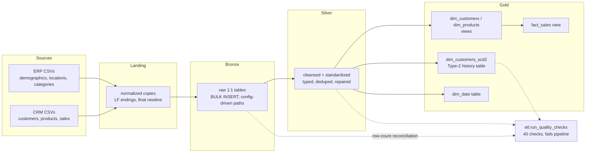

# SQL Data Warehouse — Medallion Architecture on SQL Server

An end-to-end data warehouse built with **T-SQL on SQL Server 2022**, consolidating
CRM and ERP extracts into a star schema through a Bronze → Silver → Gold medallion
architecture — with pipeline observability, an automated data-quality gate,
a Type-2 slowly changing customer dimension, and CI that rebuilds the entire
warehouse in a container on every push.

Based on the project spec by [Baraa Khatib Salkini](https://github.com/DataWithBaraa/sql-data-warehouse-project),
re-implemented from scratch and extended (see [What's different](#whats-different-from-the-base-project)).

## Architecture



- **Bronze** — exact mirrors of the source files, loaded via `BULK INSERT` with the
  file root read from `etl.config` (same procs run unmodified on a laptop or in CI).
- **Silver** — cleansing driven by upfront profiling of the raw data
  ([tools/profile_sources.py](tools/profile_sources.py)): trims 39 untrimmed names,
  dedupes 5 duplicate customer ids (6 surplus rows), repairs 200 product validity
  windows where `end < start`, decodes coded values, guards integer `yyyymmdd`
  dates against 4-digit values that `TRY_CONVERT` would silently read as a *year*,
  and repairs invalid sales/price values with a chained derivation (price first,
  sales recomputed from it) so `sales = quantity × price` holds **by construction**
  in silver — unrepairable rows keep NULLs instead of fabricated zeros.
- **Gold** — star schema: `fact_sales` + `dim_customers` + `dim_products` +
  `dim_date`, plus `dim_customers_scd2` — a persisted **SCD Type 2** dimension with
  hash-based change detection, validity windows, and stable surrogate keys.

## What's different from the base project

| Area | Base tutorial | This implementation |
|---|---|---|
| Observability | `PRINT` statements | `etl.load_run` / `etl.load_run_detail` audit tables: rows, duration, status per table per run |
| Failure behavior | `CATCH` prints and swallows errors | errors logged **and re-thrown** — the pipeline actually fails |
| Data quality | 2 SQL files of ad-hoc SELECTs to eyeball | **40 checks stored in `etl.quality_check`** (uniqueness, domains, relationships, invariants, control-character guards, fold-rate monitors), executed per layer by `etl.run_quality_checks` — error-severity violations `THROW`, and the silver gate runs **before** gold mutates the persistent SCD2 dimension |
| History | none (latest state only) | **SCD Type 2 customer dimension**: expire-then-insert with `SHA2_256` attribute hashing, idempotent re-runs, overlap/current-row invariants enforced by checks |
| Surrogate keys | `ROW_NUMBER()` in views (unstable across days) | persisted `IDENTITY` keys for the SCD2 dimension; tradeoff documented |
| Date dimension | none | generated `gold.dim_date` spanning the fact date range |
| Ingestion robustness | breaks on real-world file artifacts | landing zone normalizes CRLF/missing-final-newline (which silently dropped rows and corrupted 18k gender values); `CODEPAGE 65001` on BULK INSERT (without it, 93 non-ASCII names arrive as mojibake on any non-Latin server code page); file↔bronze row-count reconciliation |
| Portability | hardcoded `C:\` paths | config-table-driven paths; same scripts run locally (Windows, shared memory) and in CI (Linux container, TCP) |
| Orchestration | run scripts by hand in SSMS | `pipeline/run_pipeline.py` — one command, ordered execution, load summary, nonzero exit on failure |
| CI | none | GitHub Actions: full rebuild in a SQL Server 2022 container + SCD2 change-capture test on every push |

## Quickstart

Requirements: SQL Server 2022 (Express is fine), Python 3.10+, `pyodbc`,
ODBC Driver 17 or 18 for SQL Server.

```bash
pip install pyodbc
python pipeline/run_pipeline.py                # auto: full build first run, incremental after
python pipeline/run_pipeline.py --steps all    # DESTRUCTIVE rebuild (erases SCD2 history)
python pipeline/run_pipeline.py --steps load   # incremental: reload + SCD2 delta + gates
```

The default `--steps auto` only performs the destructive full rebuild when the
database does not exist yet — routine runs are incremental, so SCD2 history and
its stable surrogate keys survive. Windows integrated auth over shared memory by
default; set `DWH_SA_PASSWORD` for SQL auth (see
[.github/workflows/ci.yml](.github/workflows/ci.yml) for the containerized variant).

Pure-SQL alternative (no Python): run the scripts in `scripts/` in order with
`sqlcmd -v DATA_DIR=... DATA_ROOT=...` (both variables are required), pointing
`DATA_ROOT` at line-ending-normalized copies of the CSVs — the raw extracts use
CRLF endings and three lack a final newline, both of which BULK INSERT mishandles
(that normalization is exactly what the orchestrator's landing zone does for you).

## Repository layout

```
datasets/           raw CRM + ERP extracts (never mutated)
scripts/
  init_database.sql database, schemas, etl framework (config/log/checks), etl.try_yyyymmdd
  bronze/           DDL + config-driven BULK INSERT loader
  silver/           DDL + cleansing loader (rules documented per column)
  gold/             DDL (star schema views + SCD2 + dim_date) + loader
tests/              40 quality-check definitions + the gate procedure
pipeline/           Python orchestrator (landing zone, reconciliation, summary)
tools/              source data profiler that motivated the cleansing rules
docs/               data catalog
```

## Results (measured on this dataset)

- 116,294 source rows across 6 files → 18,484 customers, 295 products (397 versions),
  60,398 sales facts, 1,139-day calendar (2010-12-29 → 2014-02-09); full rebuild ≈ 6 s locally.
- Quality gates: 40 checks, 39 pass, 1 documented warning (7 products belong to
  category `CO_PE`, absent from the ERP category extract — a genuine source gap,
  kept visible as a warning instead of being silently dropped).
- The robustness layers exist because each one caught a real corruption during
  development, every time with all business-domain checks still green:
  - three source files lack a final newline; `cust_info.csv` and `CUST_AZ12.csv`
    silently lost their last row to BULK INSERT → caught by row-count reconciliation;
  - CRLF endings leaked `\r` into each row's last field; numeric/date columns
    silently tolerate it during type conversion, but NVARCHAR columns keep it —
    folding all 18,483 ERP gender values into `n/a` → fixed by landing
    normalization, guarded by control-character checks;
  - UTF-8 files decoded with the server's legacy code page turned 93 non-ASCII
    names into mojibake (`José` → `Jos茅`) → fixed with `CODEPAGE 65001`;
  - a 4-digit junk date (`5489`) parsed as *year 5489*, inflating `dim_date` to
    1.27M rows → fixed by the guarded `etl.try_yyyymmdd` parser.
- Adversarially reviewed: SCD2 soft-delete semantics vs. check contradictions,
  trailing-space-blind comparisons (`x != TRIM(x)` never fires under ANSI
  padding — replaced with `DATALENGTH`), tautological domain checks (backed up
  with fold-rate monitors), and `@@DATEFIRST`-dependent weekend flags were all
  found and fixed before first release.

## Data catalog

See [docs/data_catalog.md](docs/data_catalog.md) for column-level documentation
of the gold layer.
